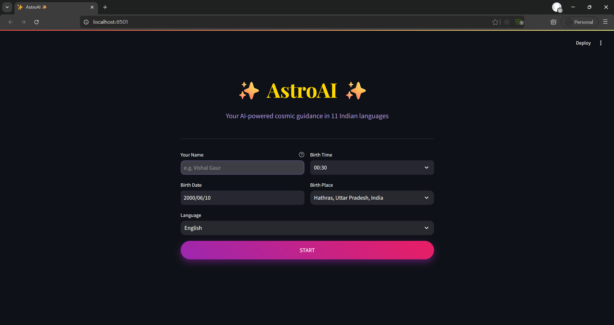
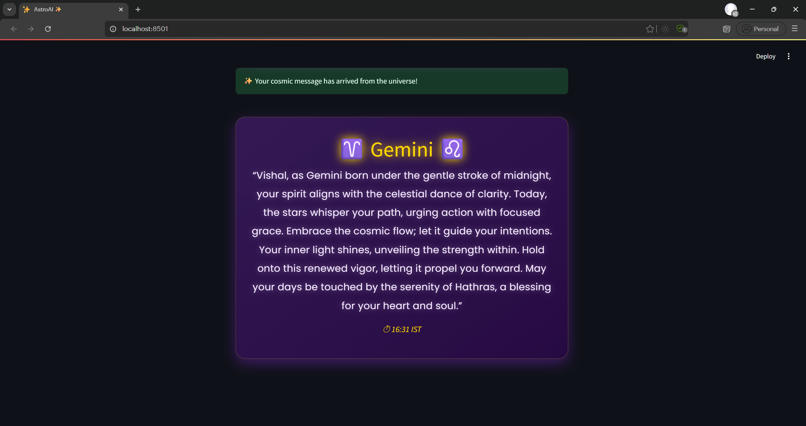
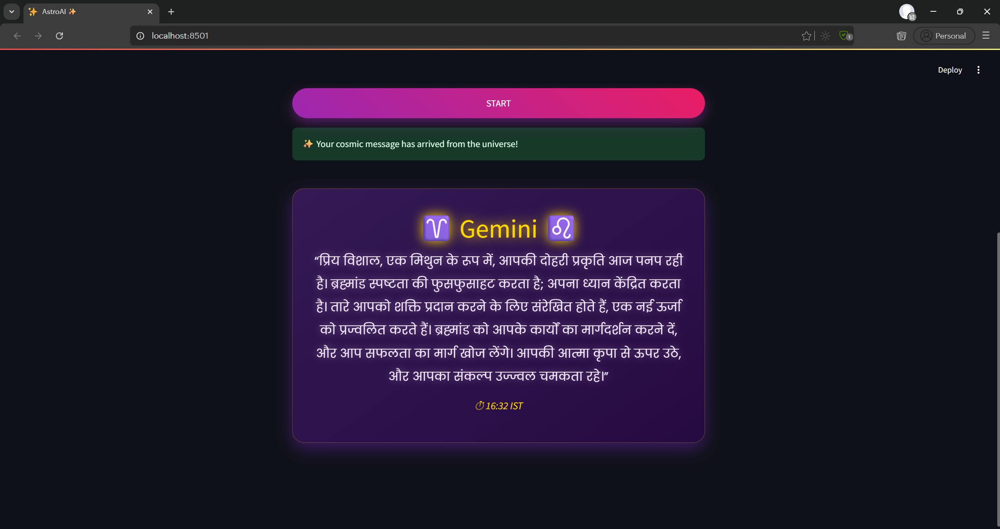
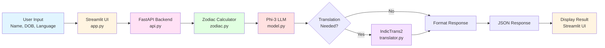

# ✨ AstroAI - AI-Powered Astrology Insights

AstroAI is an intelligent astrology application that generates personalized daily horoscopes in 11 Indian languages using AI. It combines Microsoft's Phi-3 Mini language model for generating cosmic insights and AI4Bharat's IndicTrans2 for multilingual translations.

## 🌟 Features

- **AI-Generated Horoscopes**: Personalized daily insights based on your zodiac sign
- **Multilingual Support**: Available in 11 Indian languages (English, Hindi, Tamil, Telugu, Bengali, Gujarati, Kannada, Malayalam, Punjabi, Marathi, Urdu)
- **Real-Time Generation**: Dynamic horoscope generation based on current time and date
- **Beautiful UI**: Cosmic-themed Streamlit interface with gradient backgrounds
- **City Database**: Comprehensive Indian cities database for accurate birth place selection

## 📸 Screenshots

### English Version
**Input:**



**Output:**



### Hindi Version
**Input:**


**Output:**



## 🏗️ Project Structure

```
astro-insight-pro/
│
├── images/
│   ├── input-english.png
│   ├── input-hindi.png
│   ├── output-english.png
│   └── output-hindi.png
│
├── models/
│   └── indictrans2-en-indic-dist-200M/  (downloaded separately)
│
├── .gitignore
├── api.py              # FastAPI backend server
├── app.py              # Streamlit frontend
├── city+state+india.json
├── model.py            # Phi-3 Mini LLM wrapper
├── requirements.txt
├── translator.py       # IndicTrans2 translation wrapper
└── zodiac.py          # Zodiac and time insight utilities
└── README.md 
```

## 🔧 Prerequisites

- Windows 10/11 (64-bit)
- At least 16GB RAM (8GB minimum, but 16GB recommended)
- NVIDIA GPU with at least 8GB VRAM (for CUDA support)
- 20GB free disk space
- Stable internet connection for downloading models (~8GB total)
- HuggingFace account (free - we'll create this together)

## 📋 Complete Setup Guide (Step-by-Step for Beginners)

### Part 1: Setting Up Your Windows Environment

#### Step 1: Install WSL with Ubuntu 22.04

WSL lets you run Linux on Windows, which is better for Python development.

1. **Open PowerShell as Administrator**:
   - Press `Win + X`
   - Click **"Windows PowerShell (Admin)"** or **"Terminal (Admin)"**
   - Click "Yes" when asked for permission

2. **Install WSL with Ubuntu 22.04**:
   ```powershell
   wsl --install -d Ubuntu-22.04
   ```
   - This will install WSL 2 and Ubuntu 22.04
   - Wait for the installation to complete (may take 5-10 minutes)

3. **Restart Your Computer**:
   - After installation completes, restart your PC
   - This is mandatory for WSL to work

4. **First Time Setup (After Restart)**:
    - Ubuntu 22.04 will open automatically
    - You'll see: "Enter new UNIX username:"
    - Type a username (lowercase, no spaces) - Example: yourname
    - Press Enter
    - Type a password (you won't see it while typing - this is normal)
    - Press Enter
    - Retype the same password
    - Press Enter
    - REMEMBER THIS PASSWORD - you'll need it for sudo commands

5. **Verify WSL Installation**:
   ```bash
   wsl --version
   ```
   You should see version information.
6. **Update Ubuntu 22.04 (Important First Step)**:
    Once inside Ubuntu, run:
    ```bash
    sudo apt update && sudo apt upgrade -y
    ```
    Enter your password when prompted. This ensures all packages are up to date.

#### Step 2: Install VS Code

1. **Download VS Code**:
   - Go to [https://code.visualstudio.com/](https://code.visualstudio.com/)
   - Click **"Download for Windows"**
   - Run the downloaded installer
   - Keep all default settings during installation
   - Make sure **"Add to PATH"** is checked

2. **Install Required VS Code Extensions**:
   - Open VS Code
   - Click on **Extensions** icon (left sidebar - looks like 4 squares)
   - Search and install these extensions:
     - **"WSL"** by Microsoft (MUST HAVE)
     - **"Python"** by Microsoft (MUST HAVE)
     - **"Remote - WSL"** by Microsoft (MUST HAVE)

3. **Connect VS Code to WSL**:
   - Press `Ctrl + Shift + P` (opens command palette)
   - Type: `WSL: Connect to WSL using Distro`
   - Select: `Ubuntu-22.04`
   - A new VS Code window will open connected to WSL
   - You'll see **"WSL: Ubuntu-22.04"** in the bottom-left corner (green area)

#### Step 3: Update Ubuntu in WSL

In VS Code (connected to WSL), open a terminal:
- Press `` Ctrl + ` `` (backtick key, usually below Esc)
- Or go to **Terminal → New Terminal**

Run these commands one by one:

```bash
# Update package lists
sudo apt update

# Upgrade installed packages
sudo apt upgrade -y
```

Enter your Ubuntu password when prompted.

#### Step 4: Install Python 3.10 and Essential Tools

```bash
# Install Python 3.10 and pip
sudo apt install python3.10 python3.10-venv python3-pip -y

# Install build tools (needed for some Python packages)
sudo apt install build-essential -y

# Verify Python installation
python3.10 --version
```

---

### Part 2: Setting Up the AstroAI Project

#### Step 5: Clone the Project

```bash
# Navigate to your home directory
cd ~

# Create a Projects folder
mkdir -p Projects
cd Projects

# Clone the repository (replace URL with actual repo URL)
git clone <repository-url>
cd astro-insight-pro
```

1. **Open the Project in VS Code**:
   ```bash
   # From inside the project folder
   code .
   ```
   
   This opens the project in VS Code connected to WSL.

#### Step 6: Create Python Virtual Environment

In the VS Code terminal (make sure you're in the `astro-insight-pro` folder):

```bash
# Create virtual environment
python3.11 -m venv .venv

# Activate the virtual environment
source .venv/bin/activate
```

**You'll know it worked when you see** `(.venv)` at the start of your terminal line:
```bash
(.venv) yourname@DESKTOP:~/astro-insight-pro$
```

#### Step 7: Install Python Dependencies

**This will take 10-20 minutes depending on your internet speed.**

```bash
# PHASE 1: Install PyTorch with CUDA support
pip install --no-cache-dir \
    torch==2.4.1+cu121 \
    torchaudio==2.4.1+cu121 \
    torchvision==0.19.1+cu121 \
    --index-url https://download.pytorch.org/whl/cu121
```

**Wait for this to complete** (downloads ~2GB), then:

```bash
# PHASE 2: Install all other dependencies
pip install --no-cache-dir --upgrade \
    transformers==4.45.1 \
    accelerate==0.34.2 \
    huggingface_hub==0.25.1 \
    hf-transfer==0.1.9 \
    fastapi==0.115.0 \
    uvicorn[standard]==0.32.0 \
    streamlit==1.39.0 \
    sentencepiece==0.2.0 \
    protobuf==5.28.2 \
    bitsandbytes==0.44.1 \
    IndicTransToolkit==1.1.1
```

---

### Part 3: HuggingFace Setup (Required for AI Models)

#### Step 8: Create HuggingFace Account

HuggingFace is like GitHub, but for AI models. We need an account to download the AI models.

1. **Go to HuggingFace**:
   - Open your browser: [https://huggingface.co/](https://huggingface.co/)

2. **Sign Up**:
   - Click **"Sign Up"** (top right)
   - Enter your email
   - Create a password
   - Choose a username
   - Click **"Sign Up"**

3. **Verify Email**:
   - Check your email inbox
   - Click the verification link
   - You're now logged in!

#### Step 9: Generate Access Token

An access token is like a password that lets your computer download models automatically.

1. **Go to Settings**:
   - Click your **profile picture** (top right)
   - Click **"Settings"**

2. **Create Token**:
   - In the left sidebar, click **"Access Tokens"**
   - Click **"New token"** button
   - Fill in:
     - **Name**: `astro-ai-token` (or any name you like)
     - **Type**: Select **"Read" or "Public"** access to repository
   - Click **"Generate token"**

3. **Copy Your Token**:
   - You'll see a token like: `hf_aBcDeFgHiJkLmNoPqRsTuVwXyZ1234567890`
   - **Click the copy button** (📋) next to it
   - **IMPORTANT**: Save this somewhere safe (Notepad, password manager)
   - **You can't see it again after closing this page!**

#### Step 10: Login to HuggingFace from Terminal

Back in VS Code terminal:

```bash
# Login to HuggingFace
huggingface-cli login
```

**What happens next**:
1. You'll see: `Enter your HuggingFace token:`
2. **Paste your token** (right-click in terminal → Paste, or Ctrl+Shift+V)
   - **You won't see the token while pasting** - this is normal for security
3. Press **Enter**
4. It asks: `Add token as git credential? (Y/n)`
5. Type `Y` and press **Enter**

**Success message**:
```
Token is valid (permission: read).
Your token has been saved to /home/yourname/.cache/huggingface/token
Login successful
```

#### Step 11: Accept Model License Terms

Some AI models require you to agree to their terms before downloading.

1. **Accept Phi-3 Terms**:
   - Open browser: [https://huggingface.co/microsoft/Phi-3-mini-4k-instruct](https://huggingface.co/microsoft/Phi-3-mini-4k-instruct)
   - Make sure you're **logged in**
   - You'll see a button: **"Agree and access repository"**
   - Click it
   - Page will reload - you can now access the model!

2. **Check IndicTrans2** (usually no restrictions):
   - Open: [https://huggingface.co/ai4bharat/indictrans2-en-indic-dist-200M](https://huggingface.co/ai4bharat/indictrans2-en-indic-dist-200M)
   - Make sure you can see the model page
   - If there's an "Agree" button, click it

#### Step 12: Download Translation Model

Back in VS Code terminal:

```bash
mkdir -p models

# Download IndicTrans2 model (~800MB, takes 5-10 minutes)
huggingface-cli download ai4bharat/indictrans2-en-indic-dist-200M --local-dir ./models/indictrans2-en-indic-dist-200M
```

**NOTE**: The download might crash, if you see `pytorch_model.bin` is downlaoded then you don't need to worry of the errors.

---

### Part 4: Running the Application

#### Step 13: Open Two Terminal Windows

You need to run the backend and frontend separately:

**Terminal 1 (Backend)**:
- In VS Code, you already have one terminal open
- This will be for the backend

**Terminal 2 (Frontend)**:
- In VS Code, click the **"+"** button in the terminal panel (top right of terminal)
- Or press `` Ctrl + Shift + ` ``
- A new terminal will open

**Important**: In BOTH terminals:
```bash
cd /path/to/astro-insight-pro
source .venv/bin/activate
```

You should see `(.venv)` in both terminals.

#### Step 14: Start the Backend Server (Terminal 1)

In the first terminal:

```bash
python api.py
```

**What you'll see**:
```
Loading Phi-3 Mini...
Loading IndicTrans2 Translator...
INFO:     Started server process [12345]
INFO:     Waiting for application startup.
INFO:     Application startup complete.
INFO:     Uvicorn running on http://127.0.0.1:8000 (Press CTRL+C to quit)
```

**This takes 2-5 minutes the first time** because:
- Phi-3 model downloads automatically (~7.5GB)
- Models load into memory
- Ignore the warnings

**DON'T CLOSE THIS TERMINAL!** Leave it running.

#### Step 15: Start the Frontend (Terminal 2)

Switch to the second terminal (or create a new one if needed):

```bash
streamlit run app.py
```

**What you'll see**:
```
  You can now view your Streamlit app in your browser.

  Local URL: http://localhost:8501
  Network URL: http://192.168.x.x:8501
```

**Your browser will automatically open** showing the AstroAI application!

If it doesn't open automatically:
- Hold `Ctrl` and click the `http://localhost:8501` link in the terminal
- Or manually open browser and go to: `http://localhost:8501`

---

### Part 5: Using the Application

#### Step 16: Generate Your First Horoscope

1. **Fill in Your Details**:
   - **Your Name**: Enter your name (e.g., "Vishal Gaur")
   - **Birth Date**: Click the calendar and select your birth date
   - **Birth Time**: Click and set your birth time (24-hour format)
   - **Birth Place**: Click dropdown and select your city
     - Type to search: e.g., type "Delhi" to find "Delhi, Delhi, India"
   - **Language**: Choose your preferred language

2. **Click "START" Button**:
   - The button turns into a spinner: "Consulting the stars..."
   - **First time takes 30-60 seconds** (models are loading)
   - **After first time, takes 10-15 seconds**

3. **View Your Horoscope**:
   - Balloons will appear! 🎈
   - Your zodiac sign shows at the top
   - Personalized horoscope message in your chosen language
   - Current IST timestamp

4. **Try Different Languages**:
   - Change the language dropdown
   - Click START again
   - Same horoscope, different language!

---

## 🎯 Supported Languages

| Code | Language | Script | Example Output |
|------|----------|--------|---------------|
| en   | English  | Latin  | "The stars shine brightly..." |
| hi   | हिंदी    | Devanagari | "आज आपके लिए तारे..." |
| ta   | தமிழ்    | Tamil  | "இன்று உங்களுக்கு..." |
| te   | తెలుగు   | Telugu | "ఈరోజు మీకు..." |
| bn   | বাংলা    | Bengali | "আজ আপনার জন্য..." |
| gu   | ગુજરાતી  | Gujarati | "આજે તમારા માટે..." |
| kn   | ಕನ್ನಡ   | Kannada | "ಇಂದು ನಿಮಗಾಗಿ..." |
| ml   | മലയാളം  | Malayalam | "ഇന്ന് നിങ്ങൾക്ക്..." |
| pa   | ਪੰਜਾਬੀ  | Gurmukhi | "ਅੱਜ ਤੁਹਾਡੇ ਲਈ..." |
| mr   | मराठी    | Devanagari | "आज तुमच्यासाठी..." |
| ur   | اردو     | Arabic | "آج آپ کے لیے..." |

---

## 📝 API Documentation

Once the backend is running, you can view interactive API docs:

**Open in browser**: `http://127.0.0.1:8000/docs`

### Endpoint: POST /predict

**Request**:
```json
{
  "name": "Vishal Gaur",
  "birth_date": "2000-06-10",
  "birth_time": "00:30",
  "birth_place": "Hathras, Uttar Pradesh, India",
  "language": "hi"
}
```

**Response**:
```json
{
  "zodiac": "Gemini",
  "insight": "आज आपके लिए ब्रह्मांड की ऊर्जा अद्भुत है...",
  "language": "hi"
}
```

**Test with curl**:
```bash
curl -X POST "http://127.0.0.1:8000/predict" \
  -H "Content-Type: application/json" \
  -d '{
    "name": "Test User",
    "birth_date": "1990-01-15",
    "birth_time": "10:30",
    "birth_place": "Delhi, Delhi, India",
    "language": "en"
  }'
```

---

## 🧠 Technical Details

### Models Used

1. **Microsoft Phi-3 Mini 4K Instruct**
   - Model ID: `microsoft/Phi-3-mini-4k-instruct`
   - Size: ~7.5GB
   - Purpose: Generate creative, personalized horoscope text
   - Context: 4,096 tokens
   - Auto-downloads on first run

2. **AI4Bharat IndicTrans2 En-Indic 200M**
   - Model ID: `ai4bharat/indictrans2-en-indic-dist-200M`
   - Size: ~800MB
   - Purpose: Translate English to 10 Indian languages
   - Supports: Hindi, Tamil, Telugu, Bengali, Gujarati, Kannada, Malayalam, Punjabi, Marathi, Urdu

### Architecture

### Singleton Pattern

Both `model.py` and `translator.py` use singleton pattern to:
- Load models only once (saves memory)
- Reuse same model instance for all requests
- Faster subsequent predictions


## 📄 License

This project uses:
- **Microsoft Phi-3**: MIT License
- **AI4Bharat IndicTrans2**: MIT License
- **Streamlit**: Apache 2.0 License
- **FastAPI**: MIT License

---

## 🙏 Acknowledgments

- **Microsoft** for Phi-3 Mini model
- **AI4Bharat** for IndicTrans2 translation model
- **Streamlit** for the amazing web framework
- **FastAPI** for the high-performance backend framework
- **HuggingFace** for hosting and distributing AI models